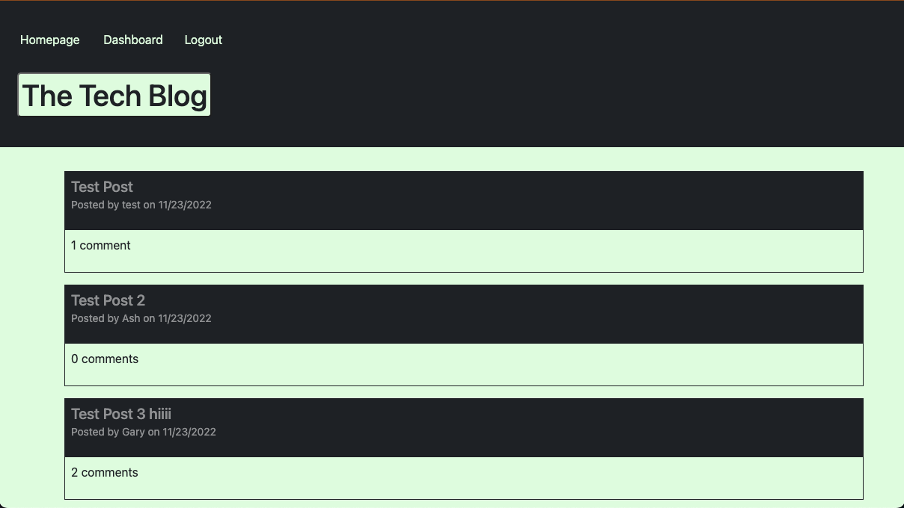
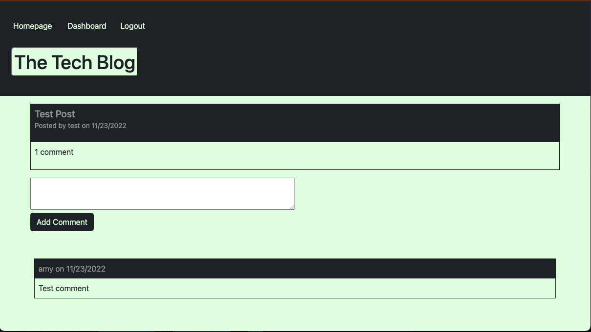
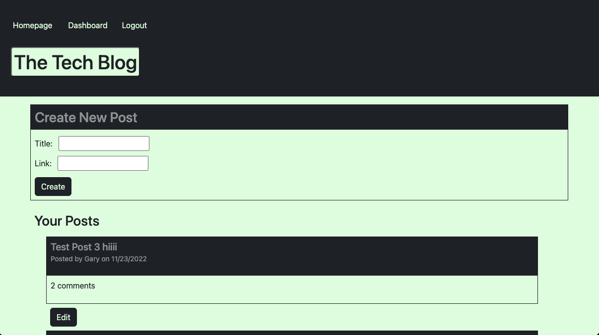
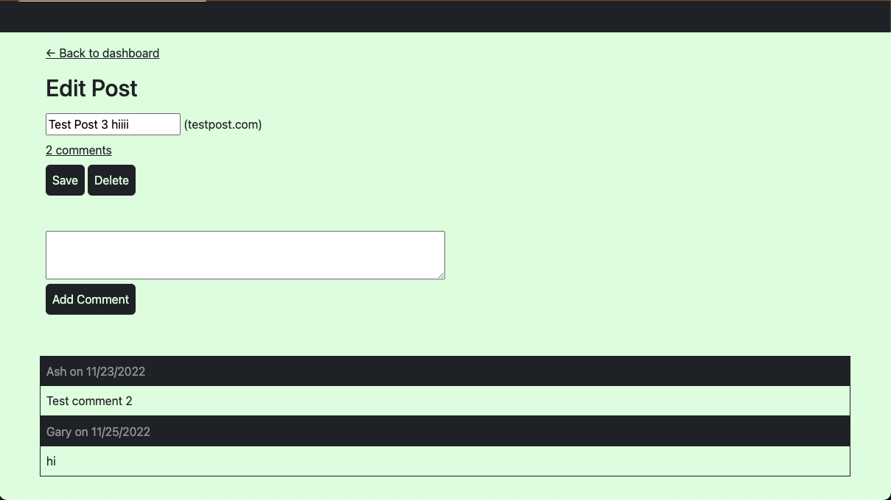

# tech-blog

## Description

Tech blog is a CMS-style blog site designed for developers to publish blog posts and comment on other developer's posts. This application uses Handlebars.js as the templating language, Sequelize as the ORM, and express-session for authentication.

## Installation

No installation needed! Simply follow this link to the deployed application on Heroku: [Link](https://tech-blog-1665.herokuapp.com/).

## Usage
 

 
 
 

 
 
 

 
 
 

 

## Credits

Made with 💛 by me, Charlie. You can check out more of my work on [GitHub](https://github.com/charliec1665).
